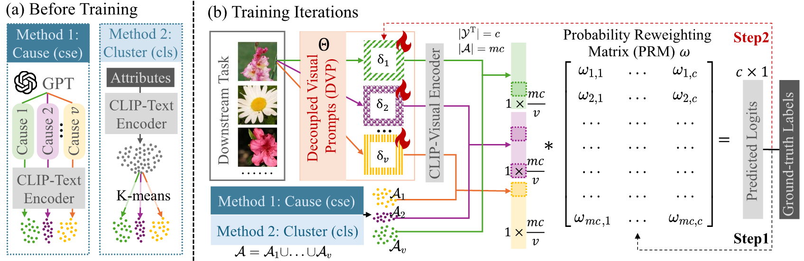

# Understanding Model Reprogramming for CLIP via Decoupling Visual Prompts

[](https://opensource.org/licenses/MIT) 
[]()
[]()

**Abstract:**
Model reprogramming adapts pretrained models to downstream tasks by modifying only the input and output spaces.
*Visual reprogramming* (VR) is one instance for vision tasks that adds a trainable noise pattern (i.e., a visual prompt) to input images to facilitate downstream classification.
The existing VR approaches for CLIP train a single visual prompt using all descriptions of different downstream classes.
However, the limited learning capacity may result in (1) a failure to capture diverse aspects of the descriptions (e.g., shape, color, and texture), and (2) a possible bias toward less informative attributes that do not help distinguish between classes.
In this paper, we introduce a decoupling-and-reweighting framework. 
Our *decoupled visual prompts* (DVP) are optimized using descriptions grouped by explicit **c**au**se**s (DVP-cse) or unsupervised **cl**u**s**ters (DVP-cls).
Then, we integrate the outputs of these visual prompts with a *probabilistic reweighting matrix* (PRM) that measures their contributions to each downstream class.
Theoretically, DVP lowers the empirical risk bound.
Experimentally, DVP outperforms baselines on average across 11 downstream datasets.
Notably, the DVP-PRM integration enables insights into how individual visual prompts influence classification decisions, providing a probabilistic framework for understanding reprogramming.

This repository is the official PyTorch implementation of the **ICML 2025** paper:
[Understanding Model Reprogramming for CLIP via Decoupling Visual Prompts](),
authored by Chengyi Cai, Zesheng Ye, Lei Feng, Jianzhong Qi, and Feng Liu.



## Environment

- Python (3.10.0)
- PyTorch (2.0.1) 
- TorchVision (0.15.2)

## Installation
    conda create -n reprogram
    conda activate reprogram
    pip install -r requirement.txt

## Dataset Preparation
### Step 1: Downloading Images
To implement the results, please follow [CoOp](https://github.com/KaiyangZhou/CoOp/blob/main/DATASETS.md#how-to-install-datasets) to download the datasets and modify `DOWNSTREAM_PATH = ""` in `cfg.py` of this repository.
Resisc45 can be prepared following [BlackVIP](https://github.com/changdaeoh/BlackVIP).
### Step 2: Preparing Descriptions
- **Use the Generated Descriptions in Our Paper**: Download the `.json` files provided by us in `attributes/` and `causes/`.
- **Generate Your Customized Causes**: Please first enter your API Key in `generate_causes.py`, then run the code: ```python generated_attributes.py```. You can modify the prompt according to your needs.

## Runing the Code for DVP-cls & DVP-cse

    python experiments/fs_dvp_cls.py --dataset [dataset]
	python experiments/fs_dvp_cse.py --dataset [dataset]

## Acknowledgements

This repo is built upon these previous works:

- [OPTML-Group/ILM-VP](https://github.com/OPTML-Group/ILM-VP)
- [CoOp & CoCoOp](https://github.com/KaiyangZhou/CoOp)
- [CuPL](https://github.com/sarahpratt/CuPL/tree/main)
- [tmlr-group/SMM](https://github.com/tmlr-group/SMM)
- [tmlr-group/BayesianLM](https://github.com/tmlr-group/BayesianLM)
- [tmlr-group/AttrVR](https://github.com/tmlr-group/AttrVR)

## Citation
    
    @inproceedings{cai2025understanding,
        title={Understanding Model Reprogramming for CLIP via Decoupling Visual Prompts},
        author={Chengyi Cai and Zesheng Ye and Lei Feng and Jianzhong Qi and Feng Liu},
        booktitle = {International Conference on Machine Learning},
        year={2025}
    }